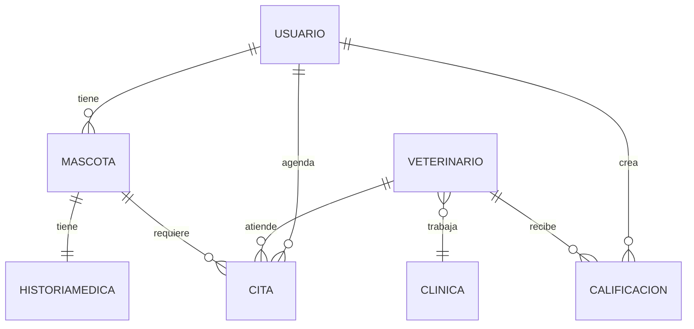

```mermaid
erDiagram
    USUARIO ||--o{ MASCOTA : tiene
    USUARIO ||--o{ CITA : agenda
    USUARIO ||--o{ CALIFICACION : crea
    VETERINARIO ||--o{ CITA : atiende
    VETERINARIO ||--o{ CALIFICACION : recibe
    VETERINARIO }o--|| CLINICA : trabaja
    MASCOTA ||--|| HISTORIAMEDICА : tiene
    MASCOTA ||--o{ CITA : requiere
```
